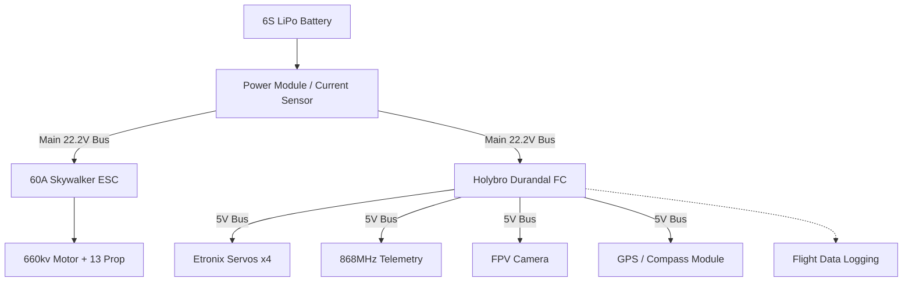

# Autonomous SAR UAV Airframe


## 📌 Overview & Design Philosophy
The SAR (Search-and-Rescue) fixed-wing UAV is a 1.5m wingspan autonomous airframe engineered for Search & Rescue operations, developed as an A-Level Design & Technology project (Awarded Grade A*). 

While multirotors dominate the SAR industry due to tight-space manoeuvrability, primary user research conducted across four UK SAR agencies (Dartmoor, Northants, London, and Brecon) highlighted a critical gap: large-area grid searches require the extended range and endurance that only a fixed-wing platform can provide.

* **Aerodynamic Selection:** Without complex simulation tools like XFLR5 at the outset, aerodynamic sizing relied on hand calculations and Airfoil Tools. The **NACA 2412** aerofoil was selected for its forgiving stall characteristics and 12% thickness ratio, which provided the necessary internal volume for spars and internal wiring.
* **Timeline:** Sep 2022 – Jun 2024  
* **Key Tools:** Fusion 360, ArduPilot, Mission Planner, LW-PLA, OrcaSlicer

---

## ⚙️ Technical Specifications

| Parameter | Specification |
| :--- | :--- |
| **Wingspan** | 1500 mm |
| **Wing Area ($S$)** |298100 mm² |
| **Mean Aerodynamic Chord (MAC)** |192.5 mm |
| **Main Wing Aerofoil** | NACA 2412 |
| **Mass** | 2.43 kg |
| **Wing Loading** | 81.5 g/dm² |
| **Wing Cube Loading** | 14.9 |
| **Stall Speed ($V_{\text{stall}}$)** | 18 m/s |
| **Propeller** | 13x6.5" - Folding |
---

## 📐 Aerodynamic & Performance Calculations

To quantify the airframe's flight envelope and assess operational launch requirements, aerodynamic calculations were conducted on the airframe geometry:

* **Absolute Stall Speed ($V_{\text{stall}}$ at $C_{L,\max}$):**
  $$V_{\text{stall}} = \sqrt{\frac{2 \cdot m \cdot g}{\rho \cdot S \cdot C_{L,\max}}}$$
  * *Parameters:* $m = 2.43\text{ kg}$, $S = 0.2981\text{ m}^2$, $\rho = 1.225\text{ kg/m}^3$, $C_{L,\max} \approx 1.2$ ($\alpha \approx 12^\circ$)
  * *Result:* $V_{\text{stall}} \approx \mathbf{10.4\text{ m/s}}\ (37.4\text{ km/h})$

* **Operational Cruise & Safe Launch Velocity ($V_{\text{launch, safe}}$):**
  $$V_{\text{launch, safe}} = \sqrt{\frac{2 \cdot m \cdot g}{\rho \cdot S \cdot C_{L,\text{cruise}}}}$$
  * *Parameters:* $C_{L,\text{cruise}} \approx 0.4$ ($\alpha \approx 2^\circ\text{ to }3^\circ$ for level flight stability)
  * *Result:* $V_{\text{launch, safe}} \approx \mathbf{18.0\text{ m/s}}\ (64.8\text{ km/h})$

* **Launch Envelope Justification:**
  While absolute minimum stall speed is $10.4\text{ m/s}$, hand-launching a $2.43\text{ kg}$ airframe with a pusher configuration sporting a 13" propeller near $C_{L,\max}$ carries an unacceptably high risk of tip-stall due to asymmetrical human throwing forces and torque roll effects as well as harm to whoever may be unfortunate enough to be selected to launch it. Defining the operational launch threshold at low AoA resulted in a calculated stall speed of $18\text{ m/s}$ necessitating an alternative launch method to reach safe flight velocity.

* **Thrust-to-Weight Ratio ($T/W$):**
  * **Motor Configuration:** Custom-wound brushless motor ($660\text{ kv}$) on 6S LiPo with a 13" folding propeller.
  * **Estimated Static Thrust:** $\ge 4.0\text{ kgf}$ (based on comparable 6S power systems and bench testing).
  * **Thrust-to-Weight Ratio:** $> 4.0 / 2.43 = \mathbf{>1.65}$
  * *Engineering Context:* A $T/W > 1.65$ provides a high power-to-weight safety margin, ensuring rapid climbing authority and overcoming high hand-launch drag.
    
* **Center of Gravity (CG) Envelope:**
  * Target CG set at **25% to 33% of Mean Aerodynamic Chord (MAC)**, located $48\text{ mm}$ to $64\text{ mm}$ aft of the main wing leading edge.

---

## ⚙️ Electronics

| Component | Specification |
| :--- | :--- |
| **Flight Controller** | Holybro Durandal (ArduPilot) |
| **Battery** | 6S LiPo (2650mAh to 4000mAh) |
| **ESC** | 60A Skywalker |
| **Propeller** | 13" Folding Prop |
| **Servo** | Etronix ET2015 Analog |

---

## 🔌 System Architecture & Power Distribution



---

## ⚙️ Key Engineering Features

* **Custom Fuselage Geometry:** Engineered an organic outer shell shape with an internal volume for avionics, battery, and rear pusher motor mounting, leaving central volume open for a future payload drop bay.
* **Serviceability & Access:** Designed hatches and external service doors into the airframe for rapid field replacement of electronics, linkages, and control surface servos.
* **Avionics Stack:** Configured for full wireless telemetry, FPV video link, and multi-sensor navigation via ArduPilot, the system incorporates an integrated power module for real-time battery voltage and current draw monitoring.

---

## 🏗️ Construction & Manufacturing Method

The airframe was manufactured using a hybrid 3D-printing and epoxy-reinforcement technique designed to maximize the strength of the LW-PLA airframe whilst simultaneously keeping the weight to a minimum.

* **3D Printing & Resin Coating:** Airframe printed in sections using Lightweight PLA (LW-PLA). To drastically improve inter-layer shear strength and structural rigidity, the outer skin was coated in multiple coats of **Easy Composites XCR Epoxy Coating Resin**.
* **Structural Alignment & Joint Bonding:** The fuselage sections were aligned using 2mm steel wire registration pins to ensure precise aerodynamic geometry, then permanently bonded using the XCR resin.
* **Kinematics & Fasteners:** Control surfaces utilize 2mm steel wire pin hinges for slop-free movement. All hatches, access covers, and servo mounts are secured using M3 heat-set brass inserts and machine screws for reliable field maintenance.
* **Finishing & Stencilling:** The airframe underwent a multi-stage post-processing workflow: hand-sanding, priming, multiple coats of orange paint, and custom stencilled airframe lettering using paper negatives. Unfortunately, some of the lettering suffered from paint bleeding under the paper stencil resulting in poor lettering in some places.
* **Systems Integration:** Final integration included full wire routing, power distribution, sensor mounting, and ArduPilot flight controller calibration.

---

## ⚠️ Engineering Challenges & Iterations

### 1. High fuselage weight and limited accessibility to internals
* **Problem:** The first iteration of the LW-PLA printed fuselage resulted in an all-up weight of roughly 800g and offered limited accessibility to the internals of the fuselage for installing electronics and servicing other internal components like the avionics mounting plate.
* **Second Iteration Solution:** The whole fuselage was redesigned to have two extra hatches to access the internals (battery, flight controller and ESC) and steps to reduce weight were taken. These steps included reducing infill and perimeter walls, and removing material in CAD where it was not required such as the plates for mounting the avionics.
* **Key Manufacturing Takeaway:** Unfortunately the removal of material in CAD did not yield the weight gains I was hoping for. Physical testing revealed an invaluable additive manufacturing constraint: cutting small holes in CAD often increases weight because perimeter walls (dense plastic) replace light-weight interior infill. While the second iteration ended up slightly heavier after post-processing, it vastly improved on the internal serviceability and structure of the first iteration so I decided to move forwards with it.

### 2. The LW-PLA trial
* **Problem:** Ideally, to make a light-weight airframe using LW-PLA you would use the slicing technique called 'Vase Mode'. When I began this project, I made multiple attempts to create the design in CAD in such a way that I could use Vase Mode but due to the complex geometries I was working with, the fact that I had never made a model plane from LW-PLA before and I was running out of time to complete the CAD phase of this project, I had to use an alternative design method.
* **Solution:** I was forced to abandon the Vase Mode technique and stick with traditional discreet layers and infill which resulted in a lot of extra filament begin used and a lot more time post processing than would have otherwise been necessary but it is a technique I am very familiar with and was able to adapt for the use case.

### 3. Control Surface Under sizing & CAD Scale Discrepancy
* **The Problem:** Designing exclusively in 3D CAD without physical scale reference points resulted in undersized control surfaces, posing a high risk of insufficient aerodynamic control authority (sluggish pitch and roll response).
* **Solution:** Physical evaluation of the first 3D-printed prototype immediately identified the scale error prior to flight testing. I returned to CAD to redesign enlarged control surfaces with significantly increased chord length and surface area to guarantee positive control authority.

### 4. High Stall Speed & Launch Risk
* **The Problem:** Mass budget underestimates during initial CAD modelling resulted in an All-Up Weight (AUW) of 2.43 kg and excessive wing loading. Sizing calculations yielded an 18 m/s stall speed ($V_{\text{stall}}$), making hand-launching nearly impossible due to immediate stall risk.
* **Solution:** While the pure aerodynamic fix requires increasing wing area, selecting a higher $C_{L,\max}$ aerofoil and reducing the airframe mass, the operational issue was solved by offloading launch acceleration to external Ground Support Equipment (GSE). A separate launch trolley was designed to bring the UAV up to flying speed without adding heavy onboard landing gear to the airframe.

### 5. Material Fatigue & Bench-Testing Thrust Failure
* **The Problem:** LW-PLA excels in aerodynamic skin structures but lacks the shear strength and fatigue resistance required for high-vibration load paths. During an incremental bench thrust test at ~45% throttle, acoustic motor vibrations rapidly amplified through the rear fuselage. The LW-PLA motor mount catastrophically disintegrated, causing the motor to tear free and destroy the adjacent V-tail control surface.
* **Solution:** Re-engineered the motor mount as an independent structural component printed in **PETG**, introducing material isolation between the high-vibration motor assembly and the delicate LW-PLA airframe.
---

## 💡 Lessons Learned & V2 Architecture

* **Material Placement Strategy:** Lightweight PLA (LW-PLA) should be reserved strictly for non-structural outer lifting surfaces. All high-stress load paths (motor mounts, spar joints, hatch latches) must be printed in dense polymers (PETG/ABS) or reinforced with carbon fiber plate.
* **DFM (Design for Manufacture):** Designing for traditional infill rather than single-wall continuous paths ("Vase Mode") adds massive post-processing overhead. V2 airframe geometry will be strictly optimized from day one for continuous single-wall extrusion.
* **CAD Scale Reference:** Designing full assemblies in 3D CAD without 1:1 physical human/component scale references distorts control surface sizing. Now I have the tools and know how to get the sizing of control surfaces right and will perform these calculations before committing to long 3D prints.

---

## 📁 Repository Structure

```text
├── Docs/             # 2D engineering drawings (PDF)
└── Media/
    ├── 01_Designing/ # Hand sketches, concept iterations
    ├── 02_CAD/       # High-res assembly renders, section views
    ├── 03_Construction/     # 3D printing process, resin coating, painting
    └── 04_Final Product/     # Completed airframe photos, beauty shots, ground test clips
